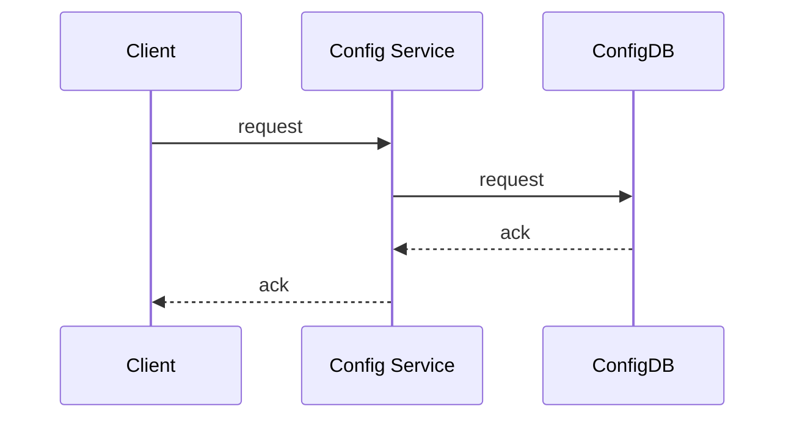
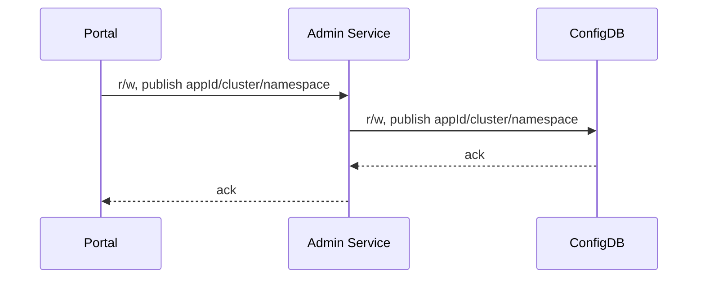
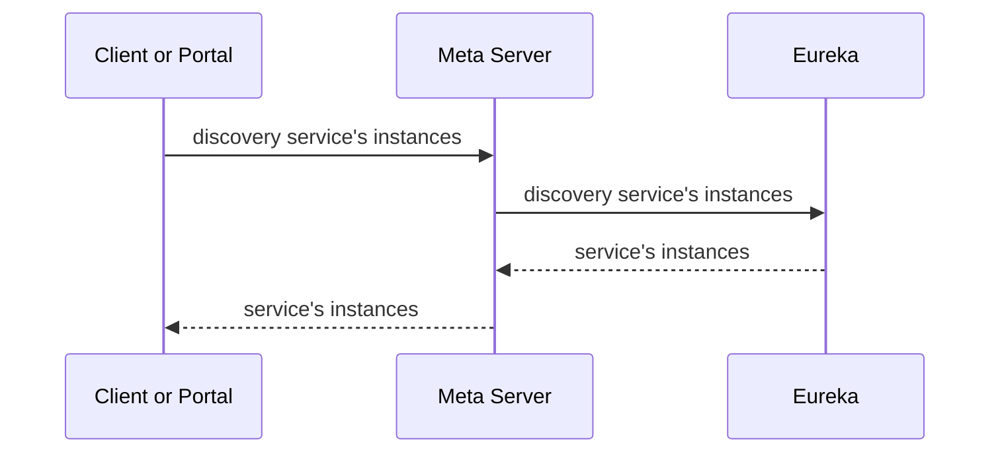
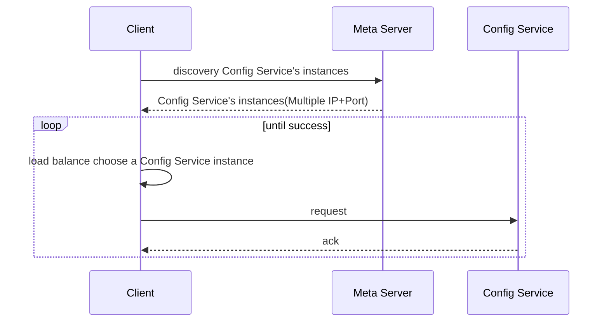
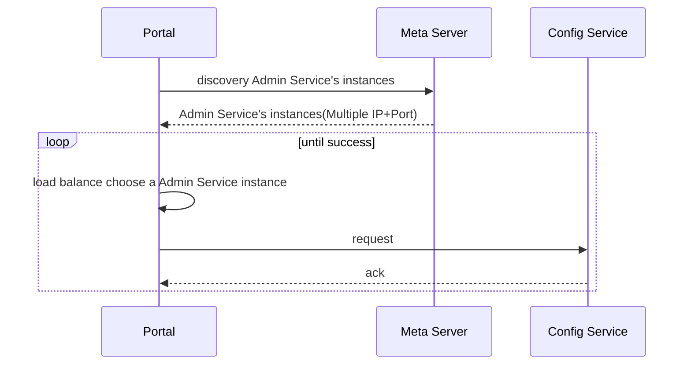
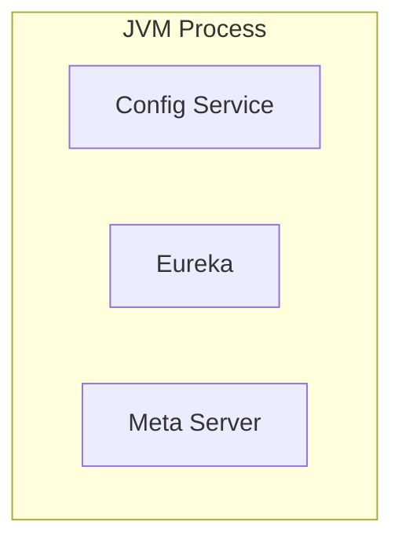
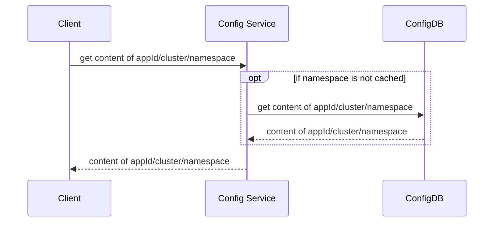

# Apollo

## 1、What is Apollo

### 1.1 背景

随着程序功能的日益复杂，程序的配置日益增多：各种功能的开关、参数的配置、服务器的地址……

对程序配置的期望值也越来越高：配置修改后实时生效，灰度发布，分环境、分集群管理配置，完善的权限、审核机制……

在这样的大环境下，传统的通过配置文件、数据库等方式已经越来越无法满足开发人员对配置管理的需求。

Apollo配置中心应运而生！

<!--more-->

### 1.2 Apollo简介

Apollo（阿波罗）是一款可靠的分布式配置管理中心，诞生于携程框架研发部，能够集中化管理应用不同环境、不同集群的配置，配置修改后能够实时推送到应用端，并且具备规范的权限、流程治理等特性，适用于微服务配置管理场景。

Apollo支持4个维度管理Key-Value格式的配置：
	
1. application (应用)
2. environment (环境)
3. cluster (集群)
4. namespace (命名空间)

同时，Apollo基于开源模式开发，开源地址：<a href="https://github.com/ctripcorp/apollo" target="_blank">https://github.com/ctripcorp/apollo</a>

### 1.2 配置基本概念

既然Apollo定位于配置中心，那么在这里有必要先简单介绍一下什么是配置。

按照我们的理解，配置有以下几个属性：

* **配置是独立于程序的只读变量**
	* 配置首先是独立于程序的，同一份程序在不同的配置下会有不同的行为。
	* 其次，配置对于程序是只读的，程序通过读取配置来改变自己的行为，但是程序不应该去改变配置。
	* 常见的配置有：DB Connection Str、Thread Pool Size、Buffer Size、Request Timeout、Feature Switch、Server Urls等。

* **配置伴随应用的整个生命周期**
	* 配置贯穿于应用的整个生命周期，应用在启动时通过读取配置来初始化，在运行时根据配置调整行为。

* **配置可以有多种加载方式**
	* 配置也有很多种加载方式，常见的有程序内部hard code，配置文件，环境变量，启动参数，基于数据库等

* **配置需要治理**
	* 权限控制
		* 由于配置能改变程序的行为，不正确的配置甚至能引起灾难，所以对配置的修改必须有比较完善的权限控制
	* 不同环境、集群配置管理
		* 同一份程序在不同的环境（开发，测试，生产）、不同的集群（如不同的数据中心）经常需要有不同的配置，所以需要有完善的环境、集群配置管理
	* 框架类组件配置管理
		* 还有一类比较特殊的配置 - 框架类组件配置，比如CAT客户端的配置。
		* 虽然这类框架类组件是由其他团队开发、维护，但是运行时是在业务实际应用内的，所以本质上可以认为框架类组件也是应用的一部分。
		* 这类组件对应的配置也需要有比较完善的管理方式。

## 2、Why Apollo

正是基于配置的特殊性，所以Apollo从设计之初就立志于成为一个有治理能力的配置发布平台，目前提供了以下的特性：

* **统一管理不同环境、不同集群的配置**
	* Apollo提供了一个统一界面集中式管理不同环境（environment）、不同集群（cluster）、不同命名空间（namespace）的配置。
	* 同一份代码部署在不同的集群，可以有不同的配置，比如zookeeper的地址等
	* 通过命名空间（namespace）可以很方便地支持多个不同应用共享同一份配置，同时还允许应用对共享的配置进行覆盖

* **配置修改实时生效（热发布）**
	* 用户在Apollo修改完配置并发布后，客户端能实时（1秒）接收到最新的配置，并通知到应用程序

* **版本发布管理**
	* 所有的配置发布都有版本概念，从而可以方便地支持配置的回滚

* **灰度发布**
	* 支持配置的灰度发布，比如点了发布后，只对部分应用实例生效，等观察一段时间没问题后再推给所有应用实例

* **权限管理、发布审核、操作审计**
	* 应用和配置的管理都有完善的权限管理机制，对配置的管理还分为了编辑和发布两个环节，从而减少人为的错误。
	* 所有的操作都有审计日志，可以方便地追踪问题

* **客户端配置信息监控**
	* 可以在界面上方便地看到配置在被哪些实例使用

* **提供Java和.Net原生客户端**
	* 提供了Java和.Net的原生客户端，方便应用集成
	* 支持Spring Placeholder, Annotation和Spring Boot的ConfigurationProperties，方便应用使用（需要Spring 3.1.1+）
	* 同时提供了Http接口，非Java和.Net应用也可以方便地使用

* **提供开放平台API**
	* Apollo自身提供了比较完善的统一配置管理界面，支持多环境、多数据中心配置管理、权限、流程治理等特性。不过Apollo出于通用性考虑，不会对配置的修改做过多限制，只要符合基本的格式就能保存，不会针对不同的配置值进行针对性的校验，如数据库用户名、密码，Redis服务地址等
	* 对于这类应用配置，Apollo支持应用方通过开放平台API在Apollo进行配置的修改和发布，并且具备完善的授权和权限控制

* **部署简单**
	* 配置中心作为基础服务，可用性要求非常高，这就要求Apollo对外部依赖尽可能地少
	* 目前唯一的外部依赖是MySQL，所以部署非常简单，只要安装好Java和MySQL就可以让Apollo跑起来
	* Apollo还提供了打包脚本，一键就可以生成所有需要的安装包，并且支持自定义运行时参数

## 3、Apollo at a glance

### 3.1 基础模型

如下即是Apollo的基础模型：

1. 用户在配置中心对配置进行修改并发布
2. 配置中心通知Apollo客户端有配置更新
3. Apollo客户端从配置中心拉取最新的配置、更新本地配置并通知到应用


### 3.2 界面概览


上图是Apollo配置中心中一个项目的配置首页

* 在页面左上方的环境列表模块展示了所有的环境和集群，用户可以随时切换。
* 页面中央展示了两个namespace(application和FX.apollo)的配置信息，默认按照表格模式展示、编辑。用户也可以切换到文本模式，以文件形式查看、编辑。
* 页面上可以方便地进行发布、回滚、灰度、授权、查看更改历史和发布历史等操作

### 3.3 添加/修改配置项

用户可以通过配置中心界面方便的添加/修改配置项，更多使用说明请参见[应用接入指南](zh/usage/apollo-user-guide)


输入配置信息：


### 3.4 发布配置

通过配置中心发布配置：


填写发布信息：


### 3.5 客户端获取配置（Java API样例）

配置发布后，就能在客户端获取到了，以Java为例，获取配置的示例代码如下。Apollo客户端还支持和Spring整合，更多客户端使用说明请参见[Java客户端使用指南](zh/usage/java-sdk-user-guide)和[.Net客户端使用指南](zh/usage/dotnet-sdk-user-guide)。

```java
Config config = ConfigService.getAppConfig();
Integer defaultRequestTimeout = 200;
Integer requestTimeout = config.getIntProperty("requestTimeout", defaultRequestTimeout);
```

### 3.6 客户端监听配置变化

通过上述获取配置代码，应用就能实时获取到最新的配置了。

不过在某些场景下，应用还需要在配置变化时获得通知，比如数据库连接的切换等，所以Apollo还提供了监听配置变化的功能，Java示例如下：

```java
Config config = ConfigService.getAppConfig();
config.addChangeListener(new ConfigChangeListener() {
  @Override
  public void onChange(ConfigChangeEvent changeEvent) {
    for (String key : changeEvent.changedKeys()) {
      ConfigChange change = changeEvent.getChange(key);
      System.out.println(String.format(
        "Found change - key: %s, oldValue: %s, newValue: %s, changeType: %s",
        change.getPropertyName(), change.getOldValue(),
        change.getNewValue(), change.getChangeType()));
     }
  }
});
```

### 3.7 Spring集成样例

Apollo和Spring也可以很方便地集成，只需要标注`@EnableApolloConfig`后就可以通过`@Value`获取配置信息：

```java
@Configuration
@EnableApolloConfig
public class AppConfig {}
```

```java
@Component
public class SomeBean {
    //timeout的值会自动更新
    @Value("${request.timeout:200}")
    private int timeout;
}
```

## 4、Apollo in depth

通过上面的介绍，相信大家已经对Apollo有了一个初步的了解，并且相信已经覆盖到了大部分的使用场景。

接下来会主要介绍Apollo的cluster管理（集群）、namespace管理（命名空间）和对应的配置获取规则。

### 4.1 Core Concepts

在介绍高级特性前，我们有必要先来了解一下Apollo中的几个核心概念：

1. **application (应用)**
	* 这个很好理解，就是实际使用配置的应用，Apollo客户端在运行时需要知道当前应用是谁，从而可以去获取对应的配置
	* 每个应用都需要有唯一的身份标识 -- appId，我们认为应用身份是跟着代码走的，所以需要在代码中配置，具体信息请参见[Java客户端使用指南](zh/usage/java-sdk-user-guide)。

2. **environment (环境)**
	* 配置对应的环境，Apollo客户端在运行时需要知道当前应用处于哪个环境，从而可以去获取应用的配置
	* 我们认为环境和代码无关，同一份代码部署在不同的环境就应该能够获取到不同环境的配置
	* 所以环境默认是通过读取机器上的配置（server.properties中的env属性）指定的，不过为了开发方便，我们也支持运行时通过System Property等指定，具体信息请参见[Java客户端使用指南](zh/usage/java-sdk-user-guide)。

3. **cluster (集群)**
	* 一个应用下不同实例的分组，比如典型的可以按照数据中心分，把上海机房的应用实例分为一个集群，把北京机房的应用实例分为另一个集群。
	* 对不同的cluster，同一个配置可以有不一样的值，如zookeeper地址。
	* 集群默认是通过读取机器上的配置（server.properties中的idc属性）指定的，不过也支持运行时通过System Property指定，具体信息请参见[Java客户端使用指南](zh/usage/java-sdk-user-guide)。

4. **namespace (命名空间)**
	* 一个应用下不同配置的分组，可以简单地把namespace类比为文件，不同类型的配置存放在不同的文件中，如数据库配置文件，RPC配置文件，应用自身的配置文件等
	* 应用可以直接读取到公共组件的配置namespace，如DAL，RPC等
	* 应用也可以通过继承公共组件的配置namespace来对公共组件的配置做调整，如DAL的初始数据库连接数

### 4.2 自定义Cluster
> 【本节内容仅对应用需要对不同集群应用不同配置才需要，如没有相关需求，可以跳过本节】
比如我们有应用在A数据中心和B数据中心都有部署，那么如果希望两个数据中心的配置不一样的话，我们可以通过新建cluster来解决。

#### 4.2.1 新建Cluster

新建Cluster只有项目的管理员才有权限，管理员可以在页面左侧看到“添加集群”按钮。


点击后就进入到集群添加页面，一般情况下可以按照数据中心来划分集群，如SHAJQ、SHAOY等。

不过也支持自定义集群，比如可以为A机房的某一台机器和B机房的某一台机创建一个集群，使用一套配置。


#### 4.2.2 在Cluster中添加配置并发布

集群添加成功后，就可以为该集群添加配置了，首先需要按照下图所示切换到SHAJQ集群，之后配置添加流程和[3.3 添加/修改配置项](#_33-添加修改配置项)一样，这里就不再赘述了。


#### 4.2.3 指定应用实例所属的Cluster

Apollo会默认使用应用实例所在的数据中心作为cluster，所以如果两者一致的话，不需要额外配置。

如果cluster和数据中心不一致的话，那么就需要通过System Property方式来指定运行时cluster：

* -Dapollo.cluster=SomeCluster
* 这里注意`apollo.cluster`为全小写

### 4.3 自定义Namespace
> 【本节仅对公共组件配置或需要多个应用共享配置才需要，如没有相关需求，可以跳过本节】
如果应用有公共组件（如hermes-producer，cat-client等）供其它应用使用，就需要通过自定义namespace来实现公共组件的配置。

#### 4.3.1 新建Namespace

以hermes-producer为例，需要先新建一个namespace，新建namespace只有项目的管理员才有权限，管理员可以在页面左侧看到“添加Namespace”按钮。


点击后就进入namespace添加页面，Apollo会把应用所属的部门作为namespace的前缀，如FX。


#### 4.3.2 关联到环境和集群

Namespace创建完，需要选择在哪些环境和集群下使用


#### 4.3.3 在Namespace中添加配置项

接下来在这个新建的namespace下添加配置项


添加完成后就能在FX.Hermes.Producer的namespace中看到配置。


#### 4.3.4 发布namespace的配置


#### 4.3.5 客户端获取Namespace配置

对自定义namespace的配置获取，稍有不同，需要程序传入namespace的名字。Apollo客户端还支持和Spring整合，更多客户端使用说明请参见[Java客户端使用指南](zh/usage/java-sdk-user-guide)和[.Net客户端使用指南](zh/usage/dotnet-sdk-user-guide)。

```java
Config config = ConfigService.getConfig("FX.Hermes.Producer");
Integer defaultSenderBatchSize = 200;
Integer senderBatchSize = config.getIntProperty("sender.batchsize", defaultSenderBatchSize);
```

#### 4.3.6 客户端监听Namespace配置变化

```java
Config config = ConfigService.getConfig("FX.Hermes.Producer");
config.addChangeListener(new ConfigChangeListener() {
  @Override
  public void onChange(ConfigChangeEvent changeEvent) {
    System.out.println("Changes for namespace " + changeEvent.getNamespace());
    for (String key : changeEvent.changedKeys()) {
      ConfigChange change = changeEvent.getChange(key);
      System.out.println(String.format(
        "Found change - key: %s, oldValue: %s, newValue: %s, changeType: %s",
        change.getPropertyName(), change.getOldValue(),
        change.getNewValue(), change.getChangeType()));
     }
  }
});
```

#### 4.3.7 Spring集成样例

```java
@Configuration
@EnableApolloConfig("FX.Hermes.Producer")
public class AppConfig {}
```

```java
@Component
public class SomeBean {
    //timeout的值会自动更新
    @Value("${request.timeout:200}")
    private int timeout;
}
```

### 4.4 配置获取规则
> 【本节仅当应用自定义了集群或namespace才需要，如无相关需求，可以跳过本节】
在有了cluster概念后，配置的规则就显得重要了。

比如应用部署在A机房，但是并没有在Apollo新建cluster，这个时候Apollo的行为是怎样的？

或者在运行时指定了cluster=SomeCluster，但是并没有在Apollo新建cluster，这个时候Apollo的行为是怎样的？

接下来就来介绍一下配置获取的规则。

#### 4.4.1 应用自身配置的获取规则

当应用使用下面的语句获取配置时，我们称之为获取应用自身的配置，也就是应用自身的application namespace的配置。

```java
Config config = ConfigService.getAppConfig();
```

对这种情况的配置获取规则，简而言之如下：

1. 首先查找运行时cluster的配置（通过apollo.cluster指定）
2. 如果没有找到，则查找数据中心cluster的配置
3. 如果还是没有找到，则返回默认cluster的配置

图示如下：


所以如果应用部署在A数据中心，但是用户没有在Apollo创建cluster，那么获取的配置就是默认cluster（default）的。

如果应用部署在A数据中心，同时在运行时指定了SomeCluster，但是没有在Apollo创建cluster，那么获取的配置就是A数据中心cluster的配置，如果A数据中心cluster没有配置的话，那么获取的配置就是默认cluster（default）的。

#### 4.4.2 公共组件配置的获取规则

以`FX.Hermes.Producer`为例，hermes producer是hermes发布的公共组件。当使用下面的语句获取配置时，我们称之为获取公共组件的配置。

```java
Config config = ConfigService.getConfig("FX.Hermes.Producer");
```

对这种情况的配置获取规则，简而言之如下：

1. 首先获取当前应用下的`FX.Hermes.Producer` namespace的配置
2. 然后获取hermes应用下`FX.Hermes.Producer` namespace的配置
3. 上面两部分配置的并集就是最终使用的配置，如有key一样的部分，以当前应用优先

图示如下：


通过这种方式，就实现了对框架类组件的配置管理，框架组件提供方提供配置的默认值，应用如果有特殊需求，可以自行覆盖。

### 4.5 总体设计


上图简要描述了Apollo的总体设计，我们可以从下往上看：

* Config Service提供配置的读取、推送等功能，服务对象是Apollo客户端
* Admin Service提供配置的修改、发布等功能，服务对象是Apollo Portal（管理界面）
* Config Service和Admin Service都是多实例、无状态部署，所以需要将自己注册到Eureka中并保持心跳
* 在Eureka之上我们架了一层Meta Server用于封装Eureka的服务发现接口
* Client通过域名访问Meta Server获取Config Service服务列表（IP+Port），而后直接通过IP+Port访问服务，同时在Client侧会做load balance、错误重试
* Portal通过域名访问Meta Server获取Admin Service服务列表（IP+Port），而后直接通过IP+Port访问服务，同时在Portal侧会做load balance、错误重试
* 为了简化部署，我们实际上会把Config Service、Eureka和Meta Server三个逻辑角色部署在同一个JVM进程中

#### 4.5.1 Why Eureka

为什么我们采用Eureka作为服务注册中心，而不是使用传统的zk、etcd呢？我大致总结了一下，有以下几方面的原因：

* 它提供了完整的Service Registry和Service Discovery实现
	* 首先是提供了完整的实现，并且也经受住了Netflix自己的生产环境考验，相对使用起来会比较省心。
* 和Spring Cloud无缝集成
	* 我们的项目本身就使用了Spring Cloud和Spring Boot，同时Spring Cloud还有一套非常完善的开源代码来整合Eureka，所以使用起来非常方便。
	* 另外，Eureka还支持在我们应用自身的容器中启动，也就是说我们的应用启动完之后，既充当了Eureka的角色，同时也是服务的提供者。这样就极大的提高了服务的可用性。
	* **这一点是我们选择Eureka而不是zk、etcd等的主要原因，为了提高配置中心的可用性和降低部署复杂度，我们需要尽可能地减少外部依赖。**
* Open Source
	* 最后一点是开源，由于代码是开源的，所以非常便于我们了解它的实现原理和排查问题。

### 4.6 客户端设计


上图简要描述了Apollo客户端的实现原理：

1. 客户端和服务端保持了一个长连接，从而能第一时间获得配置更新的推送。
2. 客户端还会定时从Apollo配置中心服务端拉取应用的最新配置。
    * 这是一个fallback机制，为了防止推送机制失效导致配置不更新
    * 客户端定时拉取会上报本地版本，所以一般情况下，对于定时拉取的操作，服务端都会返回304 - Not Modified
    * 定时频率默认为每5分钟拉取一次，客户端也可以通过在运行时指定System Property: `apollo.refreshInterval`来覆盖，单位为分钟。
3. 客户端从Apollo配置中心服务端获取到应用的最新配置后，会保存在内存中
4. 客户端会把从服务端获取到的配置在本地文件系统缓存一份
    * 在遇到服务不可用，或网络不通的时候，依然能从本地恢复配置
5. 应用程序从Apollo客户端获取最新的配置、订阅配置更新通知

#### 4.6.1 配置更新推送实现

前面提到了Apollo客户端和服务端保持了一个长连接，从而能第一时间获得配置更新的推送。

长连接实际上我们是通过Http Long Polling实现的，具体而言：

* 客户端发起一个Http请求到服务端
* 服务端会保持住这个连接60秒
    * 如果在60秒内有客户端关心的配置变化，被保持住的客户端请求会立即返回，并告知客户端有配置变化的namespace信息，客户端会据此拉取对应namespace的最新配置
    * 如果在60秒内没有客户端关心的配置变化，那么会返回Http状态码304给客户端
* 客户端在收到服务端请求后会立即重新发起连接，回到第一步

考虑到会有数万客户端向服务端发起长连，在服务端我们使用了async servlet(Spring DeferredResult)来服务Http Long Polling请求。

### 4.7 可用性考虑

配置中心作为基础服务，可用性要求非常高，下面的表格描述了不同场景下Apollo的可用性：

| 场景                   | 影响                                 | 降级                                  | 原因                                                                                    |
|------------------------|--------------------------------------|---------------------------------------|-----------------------------------------------------------------------------------------|
| 某台config service下线 | 无影响                               |                                       | Config service无状态，客户端重连其它config service                                      |
| 所有config service下线 | 客户端无法读取最新配置，Portal无影响 | 客户端重启时,可以读取本地缓存配置文件 |                                                                                         |
| 某台admin service下线  | 无影响                               |                                       | Admin service无状态，Portal重连其它admin service                                        |
| 所有admin service下线  | 客户端无影响，portal无法更新配置     |                                       |                                                                                         |
| 某台portal下线         | 无影响                               |                                       | Portal域名通过slb绑定多台服务器，重试后指向可用的服务器                                 |
| 全部portal下线         | 客户端无影响，portal无法更新配置     |                                       |                                                                                         |
| 某个数据中心下线       | 无影响                               |                                       | 多数据中心部署，数据完全同步，Meta Server/Portal域名通过slb自动切换到其它存活的数据中心 |

## 5、Contribute to Apollo

Apollo从开发之初就是以开源模式开发的，所以也非常欢迎有兴趣、有余力的朋友一起加入进来。

服务端开发使用的是Java，基于Spring Cloud和Spring Boot框架。客户端目前提供了Java和.Net两种实现。


# 总体设计

## 1.1 基础模型

如下即是Apollo的基础模型：

1. 用户在配置中心对配置进行修改并发布
2. 配置中心通知Apollo客户端有配置更新
3. Apollo客户端从配置中心拉取最新的配置、更新本地配置并通知到应用


## 1.2 架构模块

下图是Apollo架构模块的概览，详细说明可以参考[Apollo配置中心架构剖析](https://mp.weixin.qq.com/s/-hUaQPzfsl9Lm3IqQW3VDQ)。


上图简要描述了Apollo的总体设计，我们可以从下往上看：

* Config Service提供配置的读取、推送等功能，服务对象是Apollo客户端




* Admin Service提供配置的修改、发布等功能，服务对象是Apollo Portal（管理界面）




* Config Service和Admin Service都是多实例、无状态部署，所以需要将自己注册到Eureka中并保持心跳
* 在Eureka之上我们架了一层Meta Server用于封装Eureka的服务发现接口




* Client通过域名访问Meta Server获取Config Service服务列表（IP+Port），而后直接通过IP+Port访问服务，同时在Client侧会做load balance、错误重试




* Portal通过域名访问Meta Server获取Admin Service服务列表（IP+Port），而后直接通过IP+Port访问服务，同时在Portal侧会做load balance、错误重试




* 为了简化部署，我们实际上会把Config Service、Eureka和Meta Server三个逻辑角色部署在同一个JVM进程中


实际部署的架构可以参考[部署架构](zh/deployment/deployment-architecture.md)

### 1.2.1 Why Eureka

为什么我们采用Eureka作为服务注册中心，而不是使用传统的zk、etcd呢？我大致总结了一下，有以下几方面的原因：

* 它提供了完整的Service Registry和Service Discovery实现
	* 首先是提供了完整的实现，并且也经受住了Netflix自己的生产环境考验，相对使用起来会比较省心。
* 和Spring Cloud无缝集成
	* 我们的项目本身就使用了Spring Cloud和Spring Boot，同时Spring Cloud还有一套非常完善的开源代码来整合Eureka，所以使用起来非常方便。
	* 另外，Eureka还支持在我们应用自身的容器中启动，也就是说我们的应用启动完之后，既充当了Eureka的角色，同时也是服务的提供者。这样就极大的提高了服务的可用性。
	* **这一点是我们选择Eureka而不是zk、etcd等的主要原因，为了提高配置中心的可用性和降低部署复杂度，我们需要尽可能地减少外部依赖。**
* Open Source
	* 最后一点是开源，由于代码是开源的，所以非常便于我们了解它的实现原理和排查问题。

## 1.3 各模块概要介绍

### 1.3.1 Config Service

* 提供配置获取接口




* 提供配置更新推送接口（基于Http long polling）
    * 服务端使用[Spring DeferredResult](http://docs.spring.io/spring/docs/current/javadoc-api/org/springframework/web/context/request/async/DeferredResult.html)实现异步化，从而大大增加长连接数量
    * 目前使用的tomcat embed默认配置是最多10000个连接（可以调整），使用了4C8G的虚拟机实测可以支撑10000个连接，所以满足需求（一个应用实例只会发起一个长连接）。
* 接口服务对象为Apollo客户端

### 1.3.2 Admin Service

* 提供配置管理接口
* 提供配置修改、发布等接口
* 接口服务对象为Portal

### 1.3.3 Meta Server

* Portal通过域名访问Meta Server获取Admin Service服务列表（IP+Port）
* Client通过域名访问Meta Server获取Config Service服务列表（IP+Port）
* Meta Server从Eureka获取Config Service和Admin Service的服务信息，相当于是一个Eureka Client
* 增设一个Meta Server的角色主要是为了封装服务发现的细节，对Portal和Client而言，永远通过一个Http接口获取Admin Service和Config Service的服务信息，而不需要关心背后实际的服务注册和发现组件
* Meta Server只是一个逻辑角色，在部署时和Config Service是在一个JVM进程中的，所以IP、端口和Config Service一致

### 1.3.4 Eureka

* 基于[Eureka](https://github.com/Netflix/eureka)和[Spring Cloud Netflix](https://cloud.spring.io/spring-cloud-netflix/)提供服务注册和发现
* Config Service和Admin Service会向Eureka注册服务，并保持心跳
* 为了简单起见，目前Eureka在部署时和Config Service是在一个JVM进程中的（通过Spring Cloud Netflix）

### 1.3.5 Portal

* 提供Web界面供用户管理配置
* 通过Meta Server获取Admin Service服务列表（IP+Port），通过IP+Port访问服务
* 在Portal侧做load balance、错误重试

### 1.3.6 Client

* Apollo提供的客户端程序，为应用提供配置获取、实时更新等功能
* 通过Meta Server获取Config Service服务列表（IP+Port），通过IP+Port访问服务
* 在Client侧做load balance、错误重试

## 1.4 E-R Diagram

### 1.4.1 主体E-R Diagram


* **App**
    * App信息
* **AppNamespace**
    * App下Namespace的元信息
* **Cluster**
    * 集群信息
* **Namespace**
    * 集群下的namespace
* **Item**
    * Namespace的配置，每个Item是一个key, value组合
* **Release**
    * Namespace发布的配置，每个发布包含发布时该Namespace的所有配置
* **Commit**
    * Namespace下的配置更改记录
* **Audit**
    * 审计信息，记录用户在何时使用何种方式操作了哪个实体。

### 1.4.2 权限相关E-R Diagram


* **User**
    * Apollo portal用户
* **UserRole**
    * 用户和角色的关系
* **Role**
    * 角色
* **RolePermission**
    * 角色和权限的关系
* **Permission**
    * 权限
    * 对应到具体的实体资源和操作，如修改NamespaceA的配置，发布NamespaceB的配置等。
* **Consumer**
    * 第三方应用
* **ConsumerToken**
    * 发给第三方应用的token
* **ConsumerRole**
    * 第三方应用和角色的关系
* **ConsumerAudit**
    * 第三方应用访问审计

# 服务端设计

## 2.1 配置发布后的实时推送设计

在配置中心中，一个重要的功能就是配置发布后实时推送到客户端。下面我们简要看一下这块是怎么设计实现的。


上图简要描述了配置发布的大致过程：

1. 用户在Portal操作配置发布
2. Portal调用Admin Service的接口操作发布
3. Admin Service发布配置后，发送ReleaseMessage给各个Config Service
4. Config Service收到ReleaseMessage后，通知对应的客户端

### 2.1.1 发送ReleaseMessage的实现方式

Admin Service在配置发布后，需要通知所有的Config Service有配置发布，从而Config Service可以通知对应的客户端来拉取最新的配置。

从概念上来看，这是一个典型的消息使用场景，Admin Service作为producer发出消息，各个Config Service作为consumer消费消息。通过一个消息组件（Message Queue）就能很好的实现Admin Service和Config Service的解耦。

在实现上，考虑到Apollo的实际使用场景，以及为了尽可能减少外部依赖，我们没有采用外部的消息中间件，而是通过数据库实现了一个简单的消息队列。

实现方式如下：

1. Admin Service在配置发布后会往ReleaseMessage表插入一条消息记录，消息内容就是配置发布的AppId+Cluster+Namespace，参见[DatabaseMessageSender](https://github.com/apolloconfig/apollo/blob/master/apollo-biz/src/main/java/com/ctrip/framework/apollo/biz/message/DatabaseMessageSender.java)
2. Config Service有一个线程会每秒扫描一次ReleaseMessage表，看看是否有新的消息记录，参见[ReleaseMessageScanner](https://github.com/apolloconfig/apollo/blob/master/apollo-biz/src/main/java/com/ctrip/framework/apollo/biz/message/ReleaseMessageScanner.java)
3. Config Service如果发现有新的消息记录，那么就会通知到所有的消息监听器（[ReleaseMessageListener](https://github.com/apolloconfig/apollo/blob/master/apollo-biz/src/main/java/com/ctrip/framework/apollo/biz/message/ReleaseMessageListener.java)），如[NotificationControllerV2](https://github.com/apolloconfig/apollo/blob/master/apollo-configservice/src/main/java/com/ctrip/framework/apollo/configservice/controller/NotificationControllerV2.java)，消息监听器的注册过程参见[ConfigServiceAutoConfiguration](https://github.com/apolloconfig/apollo/blob/master/apollo-configservice/src/main/java/com/ctrip/framework/apollo/configservice/ConfigServiceAutoConfiguration.java)
4. NotificationControllerV2得到配置发布的AppId+Cluster+Namespace后，会通知对应的客户端

示意图如下：


### 2.1.2 Config Service通知客户端的实现方式

上一节中简要描述了NotificationControllerV2是如何得知有配置发布的，那NotificationControllerV2在得知有配置发布后是如何通知到客户端的呢？

实现方式如下：

1. 客户端会发起一个Http请求到Config Service的`notifications/v2`接口，也就是[NotificationControllerV2](https://github.com/apolloconfig/apollo/blob/master/apollo-configservice/src/main/java/com/ctrip/framework/apollo/configservice/controller/NotificationControllerV2.java)，参见[RemoteConfigLongPollService](https://github.com/apolloconfig/apollo/blob/master/apollo-client/src/main/java/com/ctrip/framework/apollo/internals/RemoteConfigLongPollService.java)
2. NotificationControllerV2不会立即返回结果，而是通过[Spring DeferredResult](http://docs.spring.io/spring/docs/current/javadoc-api/org/springframework/web/context/request/async/DeferredResult.html)把请求挂起
3. 如果在60秒内没有该客户端关心的配置发布，那么会返回Http状态码304给客户端
4. 如果有该客户端关心的配置发布，NotificationControllerV2会调用DeferredResult的[setResult](http://docs.spring.io/spring/docs/current/javadoc-api/org/springframework/web/context/request/async/DeferredResult.html#setResult-T-)方法，传入有配置变化的namespace信息，同时该请求会立即返回。客户端从返回的结果中获取到配置变化的namespace后，会立即请求Config Service获取该namespace的最新配置。

# 客户端设计


上图简要描述了Apollo客户端的实现原理：

1. 客户端和服务端保持了一个长连接，从而能第一时间获得配置更新的推送。（通过Http Long Polling实现）
2. 客户端还会定时从Apollo配置中心服务端拉取应用的最新配置。
    * 这是一个fallback机制，为了防止推送机制失效导致配置不更新
    * 客户端定时拉取会上报本地版本，所以一般情况下，对于定时拉取的操作，服务端都会返回304 - Not Modified
    * 定时频率默认为每5分钟拉取一次，客户端也可以通过在运行时指定System Property: `apollo.refreshInterval`来覆盖，单位为分钟。
3. 客户端从Apollo配置中心服务端获取到应用的最新配置后，会保存在内存中
4. 客户端会把从服务端获取到的配置在本地文件系统缓存一份
    * 在遇到服务不可用，或网络不通的时候，依然能从本地恢复配置
5. 应用程序可以从Apollo客户端获取最新的配置、订阅配置更新通知

## 3.1 和Spring集成的原理

Apollo除了支持API方式获取配置，也支持和Spring/Spring Boot集成，集成原理简述如下。

Spring从3.1版本开始增加了`ConfigurableEnvironment`和`PropertySource`：

* ConfigurableEnvironment
    * Spring的ApplicationContext会包含一个Environment（实现ConfigurableEnvironment接口）
    * ConfigurableEnvironment自身包含了很多个PropertySource
* PropertySource
    * 属性源
    * 可以理解为很多个Key - Value的属性配置

在运行时的结构形如：


需要注意的是，PropertySource之间是有优先级顺序的，如果有一个Key在多个property source中都存在，那么在前面的property source优先。

所以对上图的例子：

* env.getProperty(“key1”) -> value1
* **env.getProperty(“key2”) -> value2**
* env.getProperty(“key3”) -> value4

在理解了上述原理后，Apollo和Spring/Spring Boot集成的手段就呼之欲出了：在应用启动阶段，Apollo从远端获取配置，然后组装成PropertySource并插入到第一个即可，如下图所示：


相关代码可以参考[PropertySourcesProcessor](https://github.com/apolloconfig/apollo/blob/master/apollo-client/src/main/java/com/ctrip/framework/apollo/spring/config/PropertySourcesProcessor.java)

# 可用性考虑

<table>
<thead>
<tr>
<th width="20%">场景</th>
<th width="20%">影响</th>
<th width="30%">降级</th>
<th width="30%">原因</th>
</tr>
</thead>
<tbody>
<tr>
<td>某台Config Service下线</td>
<td>无影响</td>
<td></td>
<td>Config Service无状态，客户端重连其它Config Service</td>
</tr>
<tr>
<td>所有Config Service下线</td>
<td>客户端无法读取最新配置，Portal无影响</td>
<td>客户端重启时，可以读取本地缓存配置文件。如果是新扩容的机器，可以从其它机器上获取已缓存的配置文件，具体信息可以参考<a href='/#/zh/usage/java-sdk-user-guide?id=_123-本地缓存路径'>Java客户端使用指南 - 1.2.3 本地缓存路径</a>
</td>
<td></td>
</tr>
<tr>
<td>某台Admin Service下线</td>
<td>无影响</td>
<td></td>
<td>Admin Service无状态，Portal重连其它Admin Service</td>
</tr>
<tr>
<td>所有Admin Service下线</td>
<td>客户端无影响，Portal无法更新配置</td>
<td></td>
<td></td>
</tr>
<tr>
<td>某台Portal下线</td>
<td>无影响</td>
<td></td>
<td>Portal域名通过SLB绑定多台服务器，重试后指向可用的服务器</td>
</tr>
<tr>
<td>全部Portal下线</td>
<td>客户端无影响，Portal无法更新配置</td>
<td></td>
<td></td>
</tr>
<tr>
<td>某个数据中心下线</td>
<td>无影响</td>
<td></td>
<td>多数据中心部署，数据完全同步，Meta Server/Portal域名通过SLB自动切换到其它存活的数据中心</td>
</tr>
<tr>
<td>数据库宕机</td>
<td>客户端无影响，Portal无法更新配置</td>
<td>Config Service开启<a href="/#/zh/deployment/distributed-deployment-guide?id=_323-config-servicecacheenabled-是否开启配置缓存">配置缓存</a>后，对配置的读取不受数据库宕机影响</td>
<td></td>
</tr>
</tbody>
</table>

# 五、监控相关

## 5.1 Tracing

### 5.1.1 CAT
Apollo客户端和服务端目前支持[CAT](https://github.com/dianping/cat)自动打点，所以如果自己公司内部部署了CAT的话，只要引入cat-client后Apollo就会自动启用CAT打点。

如果不使用CAT的话，也不用担心，只要不引入cat-client，Apollo是不会启用CAT打点的。

Apollo也提供了Tracer相关的SPI，可以方便地对接自己公司的监控系统。

更多信息，可以参考[v0.4.0 Release Note](https://github.com/apolloconfig/apollo/releases/tag/v0.4.0)

### 5.1.2 SkyWalking

可以参考[@hepyu](https://github.com/hepyu)贡献的[apollo-skywalking-pro样例](https://github.com/hepyu/k8s-app-config/tree/master/product/standard/apollo-skywalking-pro)。

## 5.2 Metrics

从1.5.0版本开始，Apollo服务端支持通过`/prometheus`暴露prometheus格式的metrics，如`http://${someIp:somePort}/prometheus`


# apoll核心概念：namespace

## 1. 什么是Namespace?
Namespace是配置项的集合，类似于一个配置文件的概念。

## 2. 什么是“application”的Namespace？
Apollo在创建项目的时候，都会默认创建一个“application”的Namespace。顾名思义，“application”是给应用自身使用的，熟悉Spring Boot的同学都知道，Spring Boot项目都有一个默认配置文件application.yml。在这里application.yml就等同于“application”的Namespace。对于90%的应用来说，“application”的Namespace已经满足日常配置使用场景了。

### 客户端获取“application” Namespace的代码如下：

``` java
  Config config = ConfigService.getAppConfig();
```

### 客户端获取非“application” Namespace的代码如下：

``` java
  Config config = ConfigService.getConfig(namespaceName);
```

## 3. Namespace的格式有哪些？
配置文件有多种格式，例如：properties、xml、yml、yaml、json等。同样Namespace也具有这些格式。在Portal UI中可以看到“application”的Namespace上有一个“properties”标签，表明“application”是properties格式的。

>注1：非properties格式的namespace，在客户端使用时需要调用`ConfigService.getConfigFile(String namespace, ConfigFileFormat configFileFormat)`来获取，如果使用[Http接口直接调用](zh/usage/other-language-client-user-guide#_12-通过带缓存的http接口从apollo读取配置)时，对应的namespace参数需要传入namespace的名字加上后缀名，如datasources.json。
>注2：apollo-client 1.3.0版本开始对yaml/yml做了更好的支持，使用起来和properties格式一致：`Config config = ConfigService.getConfig("application.yml");`，Spring的注入方式也和properties一致。
## 4. Namespace的获取权限分类
Namespace的获取权限分为两种：
  
  * private （私有的）
  * public （公共的）
  
这里的获取权限是相对于Apollo客户端来说的。

### 4.1 private权限
private权限的Namespace，只能被所属的应用获取到。一个应用尝试获取其它应用private的Namespace，Apollo会报“404”异常。

### 4.2 public权限
public权限的Namespace，能被任何应用获取。

## 5. Namespace的类型

Namespace类型有三种：

  * 私有类型
  * 公共类型  
  * 关联类型（继承类型）
  
### 5.1 私有类型
私有类型的Namespace具有private权限。例如上文提到的“application” Namespace就是私有类型。


### 5.2 公共类型

#### 5.2.1 含义

公共类型的Namespace具有public权限。公共类型的Namespace相当于游离于应用之外的配置，且通过Namespace的名称去标识公共Namespace，所以公共的Namespace的名称必须全局唯一。

#### 5.2.2 使用场景

  * 部门级别共享的配置
  * 小组级别共享的配置
  * 几个项目之间共享的配置
  * 中间件客户端的配置
  

### 5.3 关联类型

#### 5.3.1 含义

关联类型又可称为继承类型，关联类型具有private权限。关联类型的Namespace继承于公共类型的Namespace，用于覆盖公共Namespace的某些配置。例如公共的Namespace有两个配置项 
```
k1 = v1
k2 = v2
```
然后应用A有一个关联类型的Namespace关联了此公共Namespace，且覆盖了配置项k1，新值为v3。那么在应用A实际运行时，获取到的公共Namespace的配置为：
```
k1 = v3
k2 = v2
```

#### 5.3.2 使用场景

举一个实际使用的场景。假设RPC框架的配置（如：timeout）有以下要求：
  * 提供一份全公司默认的配置且可动态调整
  * RPC客户端项目可以自定义某些配置项且可动态调整

1. 如果把以上两点要求去掉“动态调整”，那么做法很简单。在rpc-client.jar包里有一份配置文件，每次修改配置文件然后重新发一个版本的jar包即可。同理，客户端项目修改配置也是如此。
2. 如果只支持客户端项目可动态调整配置。客户端项目可以在Apollo “application” Namespace上配置一些配置项。在初始化service的时候，从Apollo上读取配置即可。这样做的坏处就是，每个项目都要自定义一些key，不统一。
3. 那么如何完美支持以上需求呢？答案就是结合使用Apollo的公共类型的Namespace和关联类型的Namespace。RPC团队在Apollo上维护一个叫“rpc-client”的公共Namespace，在“rpc-client” Namespace上配置默认的参数值。rpc-client.jar里的代码读取“rpc-client”Namespace的配置即可。如果需要调整默认的配置，只需要修改公共类型“rpc-client” Namespace的配置。如果客户端项目想要自定义或动态修改某些配置项，只需要在Apollo 自己项目下关联“rpc-client”，就能创建关联类型“rpc-client”的Namespace。然后在关联类型“rpc-client”的Namespace下修改配置项即可。这里有一点需要指出的，那就是rpc-client.jar是在应用容器里运行的，所以rpc-client获取到的“rpc-client” Namespace的配置是应用的关联类型的Namespace加上公共类型的Namespace。

### 5.4 例子
如下图所示，有三个应用：应用A、应用B、应用C。

 * 应用A有两个私有类型的Namespace：application和NS-Private，以及一个关联类型的Namespace：NS-Public。
 * 应用B有一个私有类型的Namespace：application，以及一个公共类型的Namespace：NS-Public。
 * 应用C只有一个私有类型的Namespace：application
 


#### 5.4.1 应用A获取Apollo配置
```java
  //application 
  Config appConfig = ConfigService.getAppConfig();
  appConfig.getProperty("k1", null); // k1 = v11
  appConfig.getProperty("k2", null); // k2 = v21
  
  //NS-Private
  Config privateConfig = ConfigService.getConfig("NS-Private");
  privateConfig.getProperty("k1", null); // k1 = v3
  privateConfig.getProperty("k3", null); // k3 = v4
  
  //NS-Public，覆盖公共类型配置的情况，k4被覆盖
  Config publicConfig = ConfigService.getConfig("NS-Public");
  publicConfig.getProperty("k4", null); // k4 = v6 cover
  publicConfig.getProperty("k6", null); // k6 = v6
  publicConfig.getProperty("k7", null); // k7 = v7
```
#### 5.4.2 应用B获取Apollo配置
```java
  //application
  Config appConfig = ConfigService.getAppConfig();
  appConfig.getProperty("k1", null); // k1 = v12
  appConfig.getProperty("k2", null); // k2 = null
  appConfig.getProperty("k3", null); // k3 = v32
  
  //NS-Private，由于没有NS-Private Namespace 所以获取到default value
  Config privateConfig = ConfigService.getConfig("NS-Private");
  privateConfig.getProperty("k1", "default value"); 
  
  //NS-Public
  Config publicConfig = ConfigService.getConfig("NS-Public");
  publicConfig.getProperty("k4", null); // k4 = v5
  publicConfig.getProperty("k6", null); // k6 = v6
  publicConfig.getProperty("k7", null); // k7 = v7
```

#### 5.4.3 应用C获取Apollo配置
```java
  //application
  Config appConfig = ConfigService.getAppConfig();
  appConfig.getProperty("k1", null); // k1 = v12
  appConfig.getProperty("k2", null); // k2 = null
  appConfig.getProperty("k3", null); // k3 = v33
  
  //NS-Private，由于没有NS-Private Namespace 所以获取到default value
  Config privateConfig = ConfigService.getConfig("NS-Private");
  privateConfig.getProperty("k1", "default value"); 
  
  //NS-Public，公共类型的Namespace，任何项目都可以获取到
  Config publicConfig = ConfigService.getConfig("NS-Public");
  publicConfig.getProperty("k4", null); // k4 = v5
  publicConfig.getProperty("k6", null); // k6 = v6
  publicConfig.getProperty("k7", null); // k7 = v7
```
#### 5.4.4 ChangeListener

以上代码例子中可以看到，在客户端Namespace映射成一个Config对象。Namespace配置变更的监听器是注册在Config对象上。

所以在应用A中监听application的Namespace代码如下：
```java
Config appConfig = ConfigService.getAppConfig();
appConfig.addChangeListener(new ConfigChangeListener() {
  public void onChange(ConfigChangeEvent changeEvent) {
    //do something
  }
})
```
在应用A中监听NS-Private的Namespace代码如下：
```java
Config privateConfig = ConfigService.getConfig("NS-Private");
privateConfig.addChangeListener(new ConfigChangeListener() {
  public void onChange(ConfigChangeEvent changeEvent) {
    //do something
  }
})
```
在应用A、应用B、应用C中监听NS-Public的Namespace代码如下：
```java
Config publicConfig = ConfigService.getConfig("NS-Public");
publicConfig.addChangeListener(new ConfigChangeListener() {
  public void onChange(ConfigChangeEvent changeEvent) {
    //do something
  }
})
```


